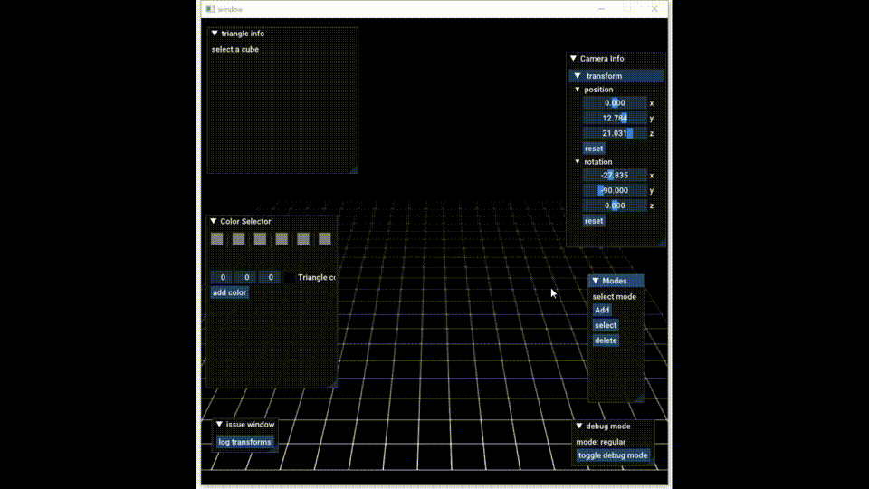

# Block Editor

Block Editor is a program aimed at allowing users to create art using blocks. It was inspired by MagicaVoxel and was programmed using C++.

## Features

-   Box collision to detect mouse input from user in the form of raycasting
-   Group selection of blocks to allow for mass movement and color manipulation
-   Ability to add and delete cubes
-   Debug functionality integrated in renderer to visualize rendering bugs
-   Color selector section that allows custom colors to be added by the user

## Videos

<h3>Adding cubes

Color change

Cube deletion

Cubes moving

</h3>
